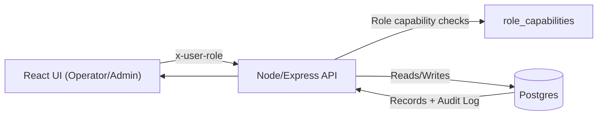
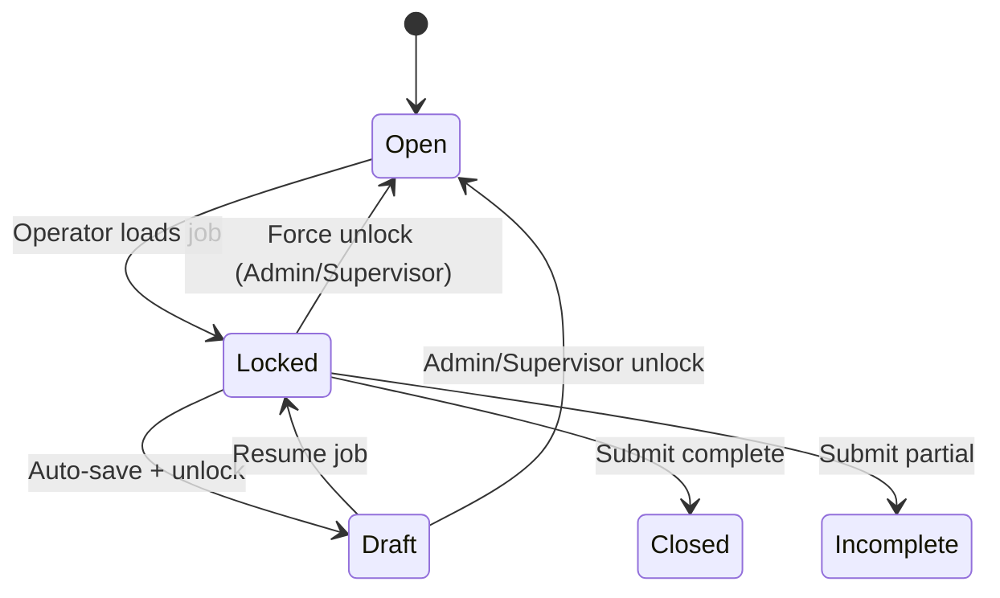

# Architecture Diagrams

## Request/Data Flow (MVP)

```mermaid
flowchart LR
  UI["React UI (Operator/Admin)"] -->|"x-user-role"| API["Node/Express API"]
  API -->|"Role capability checks"| RBAC["role_capabilities"]
  API -->|"Reads/Writes"| DB[(Postgres)]
  DB -->|"Records + Audit Log"| API
  API --> UI
```

## Job Lock Lifecycle

```mermaid
stateDiagram-v2
  [*] --> Open
  Open --> Locked: Operator loads job
  Locked --> Draft: Auto-save + unlock
  Locked --> Closed: Submit complete
  Locked --> Incomplete: Submit partial
  Draft --> Locked: Resume job
  Locked --> Open: Force unlock (Admin/Supervisor)
  Draft --> Open: Admin/Supervisor unlock
```
